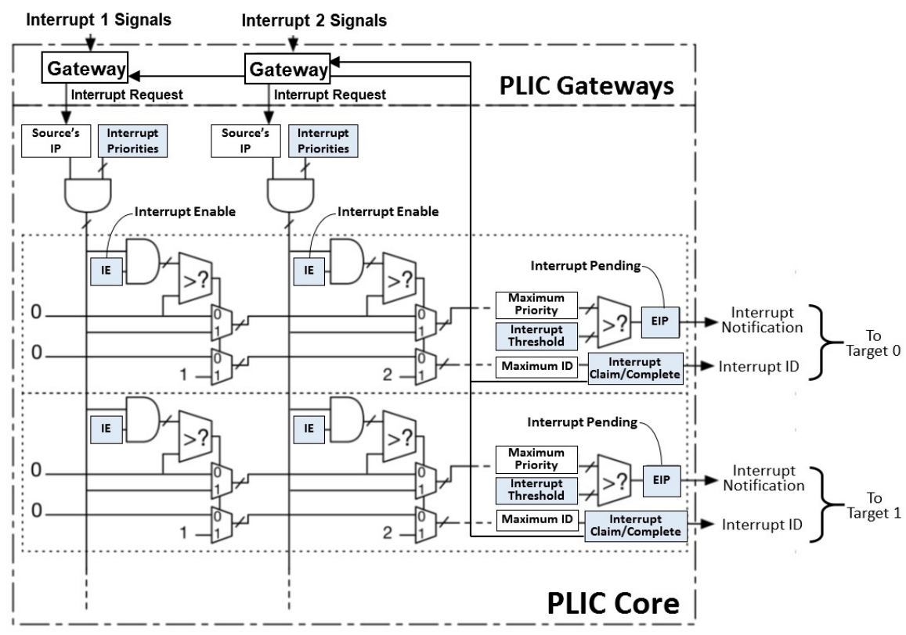
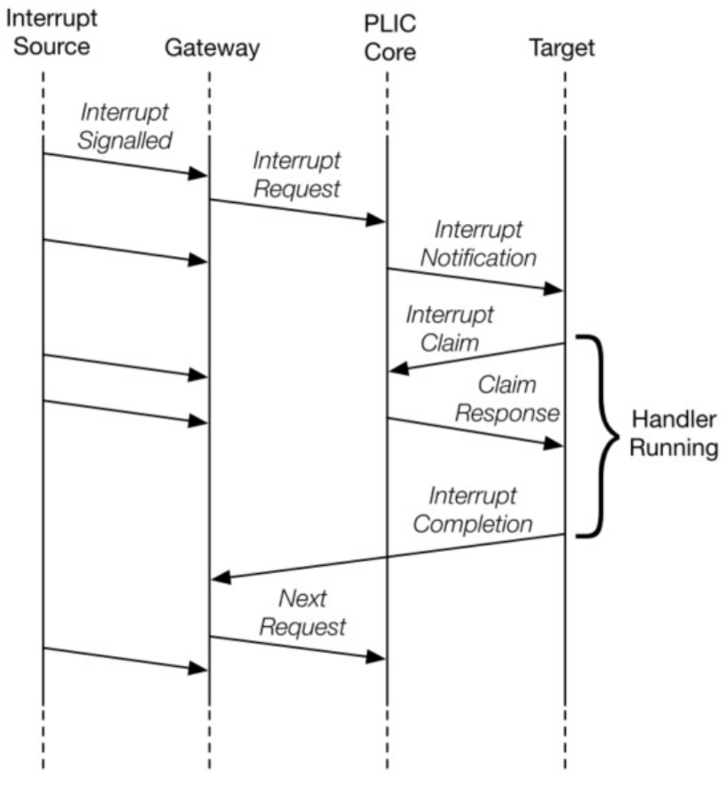

# V-PLIC

PLIC即Platform-Level Interrupt Controller，是riscv架构下的一种中断控制器。它将各种设备中断多路复用到Hart上下文的外部中断线上。

在使用PLIC的场景下，外部设备会连接到PLIC上作为中断源。当外部设备发起中断信号，信号会传递给PLIC，PLIC会根据自身配置，选出一个“最优”中断源，并发出外部中断信号给满足条件的Hart。Hart收到外部中断后，需要查询PLIC当前的“最优”中断源ID，以知晓是哪个设备发出了中断，并做相应处理。Hart需要写入PLIC的特定寄存器，以通知PLIC此趟中断处理完成；PLIC在收到完成信号后，便可处理下一个“最优”中断源。


# 结构



## Gateway

每个中断源都有一个对应的Gateway。中断网关负责将全局中断信号转换为通用中断请求（Interrupt Request）格式，并控制中断请求流向 PLIC Core。在 PLIC Core中，每个中断源在任何时候最多可以有一个中断请求（Interrupt Request）处于待处理状态，通过设置中断源的 IP 位来指示。网关仅在收到完成通知后，才会将同一源的新的中断请求转发到 PLIC Core。

即当一个中断源A发送了中断信号S1到Gateway，Gateway也已经向Core发送S1对应的一个中断请求R1，且Gateway没有收到完成（Complete）通知，那么若中断源A再次发送中断信号S2到Gateway，Gateway不会发送新的中断请求R2。

一般而言，当中断处理程序完成后，会写入Claim/Complete寄存器，此时Gateway可以收到完成（Complete）通知。

>- [ ] TODO：边缘/电平触发


## Source相关

### Source's IP（Interrupt Pending Bits）

每个中断源的Interrupt Pending Bits registers。

寄存器中的每个bit标识了一个中断源的pending状态。

它会被两种行为改变：
1. Gateway向Core发送中断请求（Interrupt Request）后，此请求会被锁存（latch）到Interrupt Pending Bit
2. PLIC收到中断声明（Claim）请求后，会清除对应中断源的Pending Bit

>即使所有context的enable关闭，也不影响gateway发送request并被latch到pending bit这一过程。当context的enable打开，pending bit的信号会自然流入

>- [ ] TODO：应该是只读的？


### Interrupt Priorities

每个中断源的优先级寄存器。

可以写入此寄存器来为每个中断源设置优先级，优先级按数值大小从低到高排列，其中0表示“从不中断”，等于禁用此中断。

当两个中断源具有相同的优先级时，中断ID更小的中断源优先级更高。


## Context相关
### Interrupt Enable

每个context的中断使能寄存器。寄存器中的每一个bit，对应一个中断源，表示此context是否接受来自此bit对应中断源的中断。

可以写入此寄存器来为context配置中断使能。


### Priority Thresholds

每个context的优先级阈值寄存器。若中断源的优先级小于或等于此寄存器的值，那么此中断源的信号会在此context上会被屏蔽。阈值为0则允许所有优先级为非0的中断。


### Interrupt Claim/Complete

每个context的Claim/Complete寄存器，这是一个寄存器，同时承担了Claim/Complete的过程。

目标可以通过mmio读取claim寄存器，此时PLIC会原子的确定，当前最高优先级的待定中断ID，并将此ID作为claim寄存器的值提供给目标；然后清除此ID对应中断源的IP位。

如果在处理claim时目标没有待处理的中断，则PLIC Core返回ID为0。

claim操作不受优先级阈值的影响，它查询当前活动中断中，优先级最高的那个的ID，是context无关的。目标甚至可以将优先级阈值设为MAX，意味关闭外部中断，然后通过主动轮询claim寄存器，来获知活动的中断。

---

PLIC通过将从claim收到的中断ID写入claim/complete寄存器来表示它已完成执行中断处理程序。PLIC 不会检查写入的complete ID是否与该目标的最后一个claim的ID相同。如果写入的complete ID与当前为目标启用的中断源ID不匹配，PLIC则会忽略这一差异。

在处理程序完成中断服务后，必须向关联的网关发送中断完成消息，通常由写入claim/complete寄存器来完成这一操作。网关只有在收到完成消息后，才会将其他中断转发到PLIC内核。


### EIP

每个中断目标在PLIC内核中都有一个外部中断挂起（EIP）位，表示相应的目标有一个等待服务的挂起中断。EIP中的值可能会因PLIC内核中状态的变化而发生变化，这是由中断源、中断目标或操作 PLIC 中寄存器值的其他代理引起的。EIP中的值将作为中断通知传达给目标目标。如果目标是 RISC-V hart 上下文，则中断通知会到达meip/seip 位。

PLIC硬件仅支持中断的多播，因此所有使能的目标都将收到给定活动中断的中断通知（多播提供快速响应，因为最快的响应者声明中断，但在高中断率场景中，如果多个hart为只有一个hart可以成功声明的中断占用trap，则可能会造成浪费。软件可以利用IE位进行调制，以提供替代策略）

中断通知中的值仅保证是在过去某个时间点有效的EIP值。特别是，当向第一个目标发送的通知仍在传输中时，第二个目标可以响应并声明（claim）中断，这样，当第一个目标尝试声明（claim）中断时，它发现它在PLIC内核中没有活动中断。


# 物理中断过程



1. 中断源发送信号至其对应Gateway
2. Gateway发送中断请求（Interrupt Request）给PLIC核心，IP位被设置
3. PLIC核心给所有满足条件的target发送Notification
4. target收到外部中断，并进行Claim来获取中断源ID
5. 而后PLIC核心清除对应的IP位
6. target处理完中断后，发送Complete通告对应Gateway
7. Gateway转发同一中断源的下一个中断请求

>- [ ] TODO：写入complete会给所有连接的gateway发送完成通知，还是只给被claim的中断源对应的gateway发送通知？这在结构图上看不出来。“在目标为中断提供服务后，它会向关联的中断网关发送中断完成消息”


# 模拟

PLIC为设备提供服务，接受来自设备的中断信号。同时使用目标cpu的中断引脚，给目标cpu发送外部中断信号。

相应的，虚拟PLIC需要为模拟设备提供一个接口，让模拟设备调用此接口来向虚拟PLIC发送中断信号。同时虚拟PLIC需要使用vcpu提供的接口，来给vcpu发送外部中断。

```rust
impl plic {
	pub fn raise_irq(irq_source_id: u32) {
		...
	}
	
	fn notification(context_id: u32, irq_source_id: u32) {
		let vcpu = get_vcpu(context_id);
		vcpu.inject_externel_irq(irq_source_id);
	}
}
```


模拟过程：
1. 模拟设备调用plic发送中断信号
2. 占据gateway后，设置pending位
3. 更新plic状态，看context是否有可通知的中断，若有则为对应vcpu设置相应中断，并将最优中断id放入claim
4. vcpu收到中断，尝试读取claim来获知是哪个设备
5. plic收到读取claim请求后，清除对应中断源的pending，返回claim
6. vcpu获取中断源，做相应处理，并写complete
7. 写入claim/complete后，解除gateway，可发送下个中断请求


